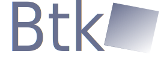

# Btk



Btk is a C++ tiny retained mode GUI library based on SDL2 and nanovg.  

It was written in morden C++,so it was very easy to use.  

***Still developing***  

## CI

|Platform| CI Status|
| ---    | ---      |
|Linux   ||
|Windows |[](https://github.com/BusyStudent/Btk/actions/workflows/windows.yml)|

----

## Tiny example  

Just create a window and add widget on here

```cpp
//Include all headers
#include <Btk.hpp>

using Btk::Window;
using Btk::Button;

struct App:public Window{
    App():Window("Hello World",100,100){
        //Add a button and connect signal
        auto &btn = add<Button>("Close the window");
        //Or
        // auto *btn = new Button("Close the window");
        // add(btn);
        
        // Set the button's position and size
        btn.set_rect(0,0,100,100);

        //You can connect to a limbda
        // btn.signal_clicked().connect([this](){
        //     close();
        // });
        //Or connect to a member fucnction
        btn.signal_clicked().connect(
            &App::close,
            this
        );
        //when the object was destroyed,
        //The connection will be disconnected automatically
    }
};
int main(){
    App app;
    app.mainloop();
}
```

----

## Features

- Almost no macro,the signal system was written in template
- The Library will use the font in os
- UTF-8 support

----

## TODO List  

- [ ] Add more useful widgets  
- [ ] MessageLoop need to be refactored  
- [ ] Rewrite ImageView By OpenGL to implement AntiAlias
- [ ] Add CMake
- [ ] Add GLX and WGL OpenGL Adapter
- [ ] Add API to get system color and system metrics
- [ ] Widget Interface need to be refactored
- [ ] String Interface need to be refactored to fit STL  
- [ ] Font need to be refactored,Current font backend is not good enough(need hb support)

----

## Widgets List

|  Widgets  |  Done?  | TODO | Description |
|  ---      |  ---    | ---  | ---         |
|  Button   |         |      |             |
|  RadioButton   |         |      |             |
|  CheckButton   |         |      |             |
|  ImageView|         |      |             |
|  TextBox  |         |Refactoring|             |
|  ProgressBar  |         |      |             |
|  EmbedWindow  | No      |      |             |
|  ScrollBar|        |      |             |
|  SilderBar|        |      |             |
|  Canvas   |         |      |             |
|  GLCanvas |         |      |             |
|  GLWidget | No      |      |             |
|  Label    |         |      |             |
|  Line     |         |      |             |
|  Layout   |         |      |             |
|  BoxLayout|         |      |             |
|  StackedWidget|     |      |             |  

----

## Renderer Backend

| Backend    | Done? | Description  |
| ---        | ---   | ---          |
| Vulkan     | No    |              |
| Software   |       | Has many bugs|
| OpenGLESv3 |       |              |
| Direct3D11 |       |              |
| SDLRender  | No    |              |

----

## Building prerequisites

### Linux

- G++ with C++17 support  
- SDL2  
- SDL2-image (optional)  
- fontconfig (optional,for select font)  
- libgif (optional,for display gif)
- freetype2  (optional)  
- scons or xmake

### Windows

- MINGW or vs2017  
- SDL2  
- SDL2-image (optional)  
- freetype2  (optional)  
- libgif (optional)  
- scons or xmake

### Android

- Still developing

----

## Build

```console
btk@btk:sudo apt install libsdl2-dev
btk@btk:scons
```

or

```console
xmake
```

## ThirdParty

[SDL2](https://www.libsdl.org/) - For Event Handling  
[SDL_image (optional)](https://www.libsdl.org/) - Load image  
[stb (optional)](https://github.com/nothings/stb) - Load image,render font,textbox edit etc...  
[nanovg](https://github.com/memononen/nanovg) - Render UI

etc...

## License

MIT
